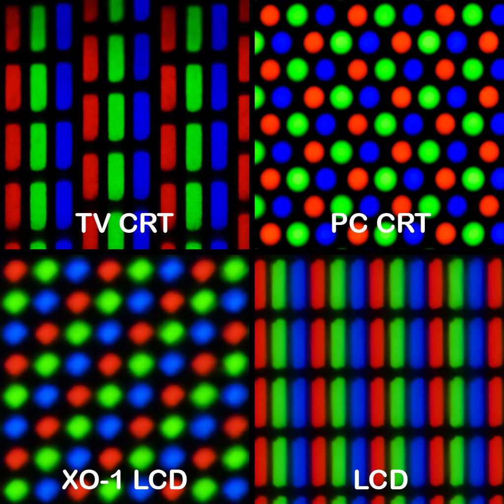
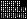
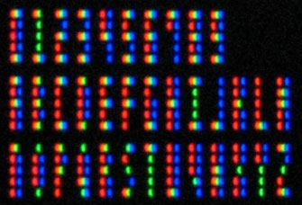
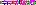
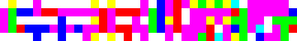

# Breaking the physical limits of fonts

The challenge: in the fewest resources possible, render meaningful text.

* How small can a font really go?
* How many bytes of memory would you need?
* How much code would it take to express it?

## Crash course in bitmaps

Computers typically represent images as bitmaps. The term bitmap is not to be confused with the `.bmp` file extension which is something quite different. It's just a way to store pixels in memory.


### Planes
Images often contain multiple _planes_. Each plane refers to one "layer" of the image. Most images contain three planes in the [RGB color space](https://en.wikipedia.org/wiki/RGB_color_space). One for _red_, _green_ and _blue_. However images with transparency often contain another plane called _alpha_. You can think of a colored image as actually three (or four for transparency) grayscale images in one.

* Note: There are other color spaces than RGB. JPEGs use [YUV](https://en.wikipedia.org/wiki/YUV) for instance. We're going to focus on RGB since it's what most people are familiar with.

There's two ways to represent this in memory. You can store each plane seperately, or you can interleave the planes. When the planes are interleaved, we use the term _channels_ instead. Interleaving is the most common method today.

Imagine we had a 4x4 image, we could represent the three planes like this, where _R_ is red, _G_ is green and _B_ is blue, respectively.

```
  R R R R
  R R R R
  R R R R
  R R R R

  G G G G
  G G G G
  G G G G
  G G G G

  B B B B
  B B B B
  B B B B
  B B B B
```

This would be storing of the planes separately.

Where as doing something like this would be interleaving.

```
  RGB RGB RGB RGB
  RGB RGB RGB RGB
  RGB RGB RGB RGB
  RGB RGB RGB RGB
```

* Note: Each cluster of characters is **exactly** one pixel
* Note: The order I've decided to put them in is called _RGB_ order, there's other orders like _BGR_ where blue comes first. The most common order is _RGB_ however.

I've taken some creative freedoms of laying out the pixels in a 2D fashion so it's more obvious how it maps, however computers don't actually have 2D memory, their memory is 1D. So the above 4x4 example would actually be:

```
RGB RGB RGB RGB RGB RGB RGB RGB RGB RGB RGB RGB RGB RGB RGB RGB
```

### BPP

The term _bpp_ is used to refer to either how many "bytes" or "bits" are used "per-pixel". You may have seen `24bpp` or `3bpp` used before, these are the same thing. One means **24 _bits_ per pixel**, the other means **3 _bytes_ per pixel**. There's **always 8 bits in a byte**. Since bit is the smaller unit, it will always be the larger number which is how you can tell if bits or bytes are being used as the unit.

### Representation

The most common format you see today is 24-bit color i.e. `24bpp`, or `3bpp`. Here's a nice way of showing what that looks like at the bit level for **one pixel** in _RGB_ order.

```
bit   0  1  2  3  4  5  6  7  8  9 10 11 12 13 14 15 16 17 18 19 20 21 22 23
pixel R  R  R  R  R  R  R  R  G  G  G  G  G  G  G  G  B  B  B  B  B  B  B  B
```
* There's one byte for _R_, one for _G_ and one for _B_.
* A byte can hold a value from 0 to 255.

So if we have a single pixel with the following color:
  * `R 255`
  * `G 80`
  * `B 100`

Then the first byte stores the value `255`, second stores the value `80` and the last stores the value `100`.

You may have seen _hex_, _hexadecimal_ or [_base-16_](https://en.wikipedia.org/wiki/Hexadecimal) representations of color before. Like `#ff5064`. This is a much nicer way of thinking about color. Each two characters refer to each channel of color. In this case; _R_ is `0xff`, which is `255` in decimal. _G_ is `0x50`, which is `80` in decimal and _B_ is `0x64`, which is `100` in decimal.

* One nice property of hexadecimal representation is that each byte of a color is represented by two characters, that means each character expresses **exactly 4 bits**. Every 4 bits is called a [nibble](https://en.wikipedia.org/wiki/Nibble).


###  Stride
When the pixels are layed out flat like that and each one has multiple channels. It can get really confusing because we can't tell when the next row of pixels in our image starts. That's why we need to know the dimensions of the image and the _bpp_ to make sense of it.
The term _stride_ is used to refer to the amount of bytes there are in one scan-line (row of pixels). In our example we have a 4x4 image, each pixel is **3bpp**, that means we have a stride of `4*3` bytes, or generally, `w*bpp` bytes.

* It's not always true that an image has a stride of `w*bpp`, sometimes images have "hidden" padding pixels that are meant to keep the image's dimensions a power of some size. As an example, working with power of two's is far easier and faster when scaling images. So you may have an image that is `120x120` pixels (that you can see) but the actual representation is `128x128` and those "padding" pixels are skipped over when previewing the image. We won't worry about that here.

This is a very simple mapping, for any pixel `(x, y)` the 1D location of it is `(y * w + x) * bpp`. Think about the math of this for a moment, `y` is the row of the pixel, we know each row has `w` pixels, so `y * w` moves us through the rows, `x` moves us along that row to the specific `x` coordinate on that row. However, that only works when we have one byte per pixel, since we interleaved _R_, _G_ and _B_, we need to actually move in units of what ever `bpp` is, so multiplying the whole thing by `3`, or `bpp` in the general case gives us the 1D location of the pixel. More specifically, it gives us the location of the first channel for that pixel. Reading exactly `bpp` bytes from that location gives us a whole pixel.

## The font atlas
The way displays actually display pixels is through the use of three sub-pixels, one red, one green and another blue. If you zoomed in real close to a single pixel what you'd see is something that resembles this depending on your display.


* Taken from https://en.wikipedia.org/wiki/Subpixel_rendering#/media/File:Pixel_geometry_01_Pengo.jpg

The one we're interested in exploiting is LCD as that's likely the display technology you're reading this on.

There's some caveats of course

* Not all displays have this subpixel pattern, some might put blue before red resulting in a BGR pattern.
* If your display is rotated (phone or tablet) this pattern will be rotated too and this font will stop working.
* Different subpixel patterns and orientations actually require different subpixel rendering of fonts themselves.

This method of exploiting subpixels for additional rendering resolution is called [subpixel rendering](https://en.wikipedia.org/wiki/Subpixel_rendering).

Fortunately for us, someone has already had this idea and built something called [millitext](http://www.msarnoff.org/millitext/). Their work is listed here.

They built the following tiny image by hand.



Which if you look at your monitor close enough looks like.



Here it is scaled up 12x.


That brings us to this really tiny image which is actually a font atlas built off his work, each `1x5` pixels represents a character. The atlas was created by hand and layed out like so.
```
0123456789ABCDEFGHIJKLMNOPQRSTUVWXYZ
```



That might be difficult to see, so I've scaled it up 12x



Which works out to exactly `36x5` pixels in size. The PNG is also `4bpp`, since it also has an alpha channel, but we will be ignoring that. Assuming we store each pixel as `RGB`, we'd need exactly `36*5*3` bytes, or `540` bytes to represent this as a bitmap. That's actually surprsingly good already, since the PNG itself is actually:
```
# wc -c < font.png 
15118
```
**27x larger!**
* This command tells us how many "bytes" are in a file on a Linux PC.
* This is 14 KiB!

PNG is not well suited for storing things like this since it's already too small. In fact a [BMP](https://en.wikipedia.org/wiki/BMP_file_format) can do a much better job, look:

```
# wc -c < font.bmp
858
```

We can do much better than this though.

# Compressing

The acute of you may have noticed something interesting about the atlas, there's only seven colors in it, these colors in particular:

0. `#ffffff`
1. `#ff0000`
2. `#00ff00`
3. `#0000ff`
4. `#00ffff`
5. `#ff00ff`
6. `#ffff00`

## Palette
When we only have a few colors like this, it's often easier to create a palette and refer to colors in the palette instead of each pixel being the color value itself. Assuming we use the palette above, then each pixel only ever needs to be represented by a single value in the range 0-6.

* 1-bit can represent 2 possible states (0, 1)
* 2-bit can represent 4 possible states (0, 1, 2, 3)
* 3-bit can represent 8 possible states (0, 1, 2, 3, 4, 5, 6, 7)

If we represented each pixel as a 3-bit quantity, where the value of that pixel referred to our palette, we would only need **68 bytes** to represent the entire atlas.

* The data compression folks out there might point out that you can have such a thing as a "fractional bit", the perfect size we actually need here is **2.875 bits**. This is often accomplished through something called [entropy coding](https://en.wikipedia.org/wiki/Entropy_encoding). However, if you look at the actual atlas, entropy coding won't actually work because there is no group of pixels that share a common bit pattern here.

## Alignment
There's an ugly problem with 3-bit encoding though. It does not divide evenly into a byte. A byte is the smallest addressable unit computers can actually deal with. Imagine we have these three pixels:
```
A B C
```

If each one takes 3-bits, then two bytes would look like this in memory, where `-` denotes an unused bit.
```
bit   0  1  2  3  4  5  6  7  8  9 10 11 12 13 14 15
pixel A  A  A  B  B  B  C  C  C  -  -  -  -  -  -  -
```

See that, the **C** pixel takes up one bit of the next byte, it's _split_ across the bytes and in fact, as we start adding more pixels, they can be split up and straddle anywhere! Here we just have 1-bit inside another byte, but in practice a pixel can end up 2-bits inside another byte, 3-bits inside another byte, etc.

An easy solution to this problem would be to use a nibble per pixel, since 4 divides evenly into 8, this would keep everything _aligned_ on a byte, allowing exactly 2 pixels per byte, but it also takes our atlas up from **68 bytes** to **90 bytes**, which is **1.3x** larger.

## Bit buffer
Fortunutely it's still possible to work with 3-bit quanities, it just requires keeping track of which bit in a byte you are at when encoding and decoding.

Included here is a simple class which writes 3-bit quanities into a byte array.

* To keep this as accessible as possible for readers, the code will be written in JS but can be extended to other languages.
* All code will assume [Little Endian](https://en.wikipedia.org/wiki/Endianness) byte order since that's the most common.

```js
class BitBuffer {
  constructor(bytes) {
    this.data = new Uint8Array(bytes);
    this.offset = 0;
  }
  write(value) {
    for (let i = 0; i < 3; ) {
      // bits remaining
      const remaining = 3 - i;

      // bit offset in the byte i.e remainder of dividing by 8
      const bit_offset = this.offset & 7;

      // byte offset for a given bit offset, i.e divide by 8
      const byte_offset = this.offset >> 3;

      // max number of bits we can write to the current byte
      const wrote = Math.min(remaining, 8 - bit_offset);

      // mask with the correct bit-width
      const mask = ~(0xff << wrote);

      // shift the bits we want to the start of the byte and mask off the rest
      const write_bits = value & mask;

      // destination mask to zero all the bits we're changing first
      const dest_mask = ~(mask << bit_offset);
      value >>= wrote;
    
      // write it
      this.data[byte_offset] = (this.data[byte_offset] & dest_mask) | (write_bits << bit_offset);

      // advance
      this.offset += wrote;
      i += wrote;
    }
  }
  to_string() {
    return Array.from(this.data, (byte) => ('0' + (byte & 0xff).toString(16)).slice(-2)).join('');
  }
};
```

So, lets load in that atlas PNG, ignore the alpha and encode it into our bit buffer, we'll use [png-js](https://www.npmjs.com/package/pngjs) for this.

```js
const PNG = require('png-js');
const fs = require('fs');

// this is our palette of colors
const Palette = [
  [0xff, 0xff, 0xff],
  [0xff, 0x00, 0x00],
  [0x00, 0xff, 0x00],
  [0x00, 0x00, 0xff],
  [0x00, 0xff, 0xff],
  [0xff, 0x00, 0xff],
  [0xff, 0xff, 0x00]
];

// given a color represented as [R, G, B], find the index in palette where that color is
function find_palette_index(color) {
  const [sR, sG, sB] = color;
  for (let i = 0; i < Palette.length; i++) {
    const [aR, aG, aB] = Palette[i];
    if (sR === aR && sG === aG && sB === aB) {
      return i;
    }
  }
  return -1;
}

// build the bit buffer representation
function build(cb) {
  const data = fs.readFileSync('subpixels.png');
  const image = new PNG(data);
  image.decode(function(pixels) {
    // we need 3 bits per pixel, so w*h*3 gives us the # of bits for our buffer
    // however BitBuffer can only allocate bytes, dividing this by 8 (bits for a byte)
    // gives us the # of bytes, but that division can result in 67.5 ... Math.ceil
    // just rounds up to 68. this will give the right amount of storage for any
    // size atlas.
    let result = new BitBuffer(Math.ceil((image.width * image.height * 3) / 8));
    for (let y = 0; y < image.height; y++) {
      for (let x = 0; x < image.width; x++) {
        // 1D index as described above
        const index = (y * image.width + x) * 4;
        // extract the RGB pixel value, ignore A (alpha)
        const color = Array.from(pixels.slice(index, index + 3));
        // write out 3-bit palette index to the bit buffer
        result.write(find_palette_index(color));
      }
    }
    cb(result);
  });
}

build((result) => console.log(result.to_string()));
```

After all that work, we now have a single bit buffer containing our atlas in exactly **68 bytes**.

To put that in perspective, here's the original PNG
```
# wc -c < font.png 
15118
```

We're **222x** smaller!

That's not a mistake. We've compressed something down to **0.45%** it's original size!

Now lets convert the representation to a string so we can embed it into our source code. That's essentially what the `to_string` method does. It reads off the contents of each byte into a single base-16 number.
```
305000000c0328d6d4b24cb46d516d4ddab669926a0ddab651db76150060009c0285e6a0752db59054655bd7b569d26a4ddba053892a003060400d232850b40a6b61ad00
```

However, this is still quite long to embed. Fortunutely this is because we've limited ourselfs to base-16 which has an alphabet of 16 characters. A better encoding method for this is actually [base-64](https://en.wikipedia.org/wiki/Base64), which gives us 4x more characters, so lets change `to_string` to use that.
```js
to_string() {
  return Buffer.from(this.data).toString('base64');
}
```

Which then gives us:
```
MFAAAAwDKNbUsky0bVFtTdq2aZJqDdq2Udt2FQBgAJwCheagdS21kFRlW9e1adJqTdugU4kqADBgQA0jKFC0CmthrQA=
```

Meaning we can now embed this single string in our JS and begin rasterizing millitext.

# Rasterizing text

TODO
